<p align="center">
  
</p>

<div align="center">

   
   
   
</div>

<h1 align="center">Diseño de Interfaces</h1>

## Tabla de Contenidos
- [Contexto del Proyecto](#contexto-del-proyecto)
- [Justificación del Diseño](#justificación-del-diseño)
- [Reutilización en React](#reutilización-en-react)
- [Plantilla de Inicio de sesión](#plantilla-de-inicio-de-sesión)
- [Plantilla del Dashboard](#plantilla-del-dashboard)
- [Plantilla de Registro de Usuarios](#plantilla-de-registro-de-usuarios)
- [Plantilla de Correo Electrónico](#plantilla-de-correo-electrónico)
- [Plantilla de Notificaciones](#plantilla-de-notificaciones)
- [Plantilla de Evaluaciones](#plantilla-de-evaluaciones)
- [Plantilla de Historial Académico](#plantilla-de-historial-académico)
- [Autor](#autor)

## Contexto del Proyecto
 Debido a que en nuestro equipo de trabajo no contábamos con un diseñador `UX/UI` y estábamos conformados mayormente por desarrolladores backend, tomamos la decisión de desarrollar las vistas directamente en `HTML`, `CSS` y `Javascript`. Posteriormente, el desarrollador frontend se encargará de integrar estos diseños en `React`, la tecnología elegida para nuestra plataforma School Manager.

## Justificación del Diseño

### Proceso de Investigación

Para el diseño de la aplicación, comenzamos contactando a conocidos que podrían utilizar este tipo de plataformas en un entorno educativo. Recibimos fotos y videos que nos ayudaron a identificar necesidades y preferencias de los usuarios potenciales. A partir de esta información, pudimos tener una mejor comprensión de los requerimientos y expectativas en cuanto a la interfaz y funcionalidad.

### Elección de Colores
La elección de colores fue un proceso basado en la investigación sobre el significado y el impacto de los colores en el usuario. Buscamos crear una experiencia visual que transmitiera profesionalismo y accesibilidad, al tiempo que facilitara la navegación y la interacción.

- **Color principal (--primary-color: #34495E)**: Optamos por un azul oscuro, que transmite confianza, estabilidad y profesionalismo. Este color se usa en los textos y bordes para proporcionar una sensación de seriedad y confianza, algo crucial en una plataforma educativa.

- **Color secundario (--secondary-color: #E67E22)**: Elegimos un tono anaranjado para resaltar elementos interactivos y proporcionar contraste. El anaranjado es un color que capta la atención sin ser demasiado agresivo, lo que ayuda a resaltar botones y títulos importantes, mejorando la experiencia del usuario.

- **Colores de fondo y borde (--background-color: #f4f4f4, --border-color: #BDC3C7)**: Seleccionamos un fondo claro y neutro para mantener la interfaz limpia y legible. Este enfoque facilita la lectura y evita distracciones, creando un entorno de trabajo más agradable y menos sobrecargado.

### Simplicidad y Usabilidad
El diseño se centró en la simplicidad y la funcionalidad, garantizando que las vistas sean intuitivas y fáciles de navegar. El uso de un diseño minimalista ayuda a que los usuarios se enfoquen en las tareas principales sin distracciones innecesarias. La estructura clara y los elementos interactivos bien definidos buscan mejorar la usabilidad y la accesibilidad de la plataforma.

## Reutilización en React
El código `HTML` y `CSS` se estructuró de manera que sea fácilmente adaptable a componentes de `React`. Se implementó una estructura clara de clases y variables `CSS` (:root) para que los estilos puedan modificarse fácilmente dentro del ecosistema `React`.

El dashboard se diseñó de forma modular, permitiendo que cada opción sea fácilmente reutilizable o modificable como componente `React`. Los elementos interactivos como botones y enlaces fueron estilizados con transiciones, lo que facilita una experiencia de usuario fluida y dinámica en `React`.

## Plantilla de Inicio de Sesión
El formulario está centrado en la pantalla, con campos claramente etiquetados. Se incluye un enlace para recuperar la contraseña, facilitando la experiencia del usuario.

<p align="center">
  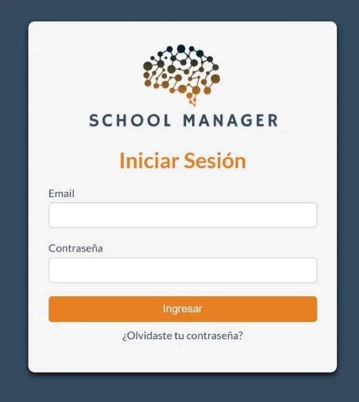
</p>

## Plantilla del Dashboard

El dashboard presenta un diseño simple y visualmente atractivo con una estructura limpia que facilita la navegación. Cada opción está representada por un ícono que, al hacer hover, aumenta de tamaño para dar feedback visual al usuario. Este enfoque visual reduce la curva de aprendizaje y mejora la experiencia del usuario.

  - Opciones destacadas: Las opciones como "Historial Académico", "Rendimiento" y "Mensajes" están representadas mediante imágenes de gran tamaño para facilitar la comprensión y accesibilidad. Además, se usan sombras y transiciones para que las interacciones sean más fluidas y agradables.

<p align="center">
  
</p>

## Plantilla de Registro de Usuarios

Las pantallas de registro para padres/tutores, alumnos y profesores se diseñaron con un enfoque en simplicidad y funcionalidad. Cada tipo de usuario tiene un formulario de registro específico, ya que se requiere registrar información diferente para cada uno.

El uso de un esquema de colores neutros y tipografía clara garantiza una experiencia de usuario accesible y agradable, facilitando la lectura y navegación. Cada pantalla sigue una estructura coherente, con secciones claramente definidas para la información personal, contacto y datos adicionales, permitiendo una fácil comprensión y completado del formulario. Además, se incluyen botones dinámicos que permiten añadir campos adicionales (como hijos o materias), lo que mejora la flexibilidad del formulario sin recargar la interfaz.

### Formulario de Registro de Alumnos
<p align="center"> 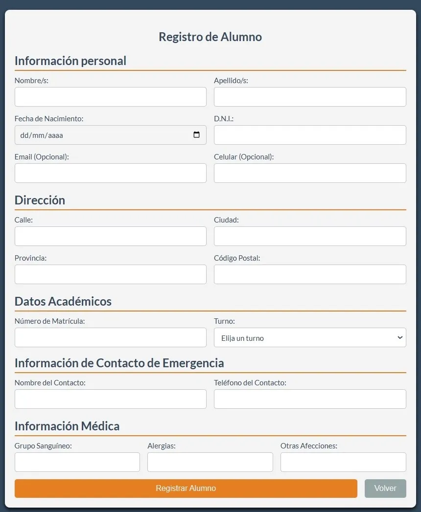 </p>

### Formulario de Registro de Padres/Tutores
<p align="center"> 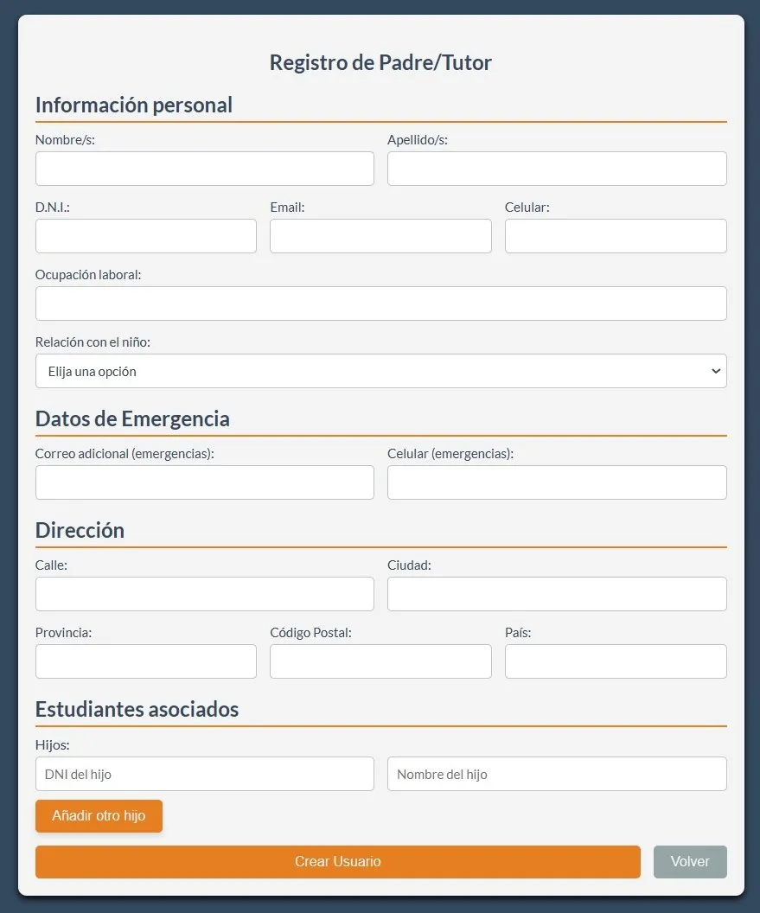 </p>

### Formulario de Registro de Profesores
<p align="center"> 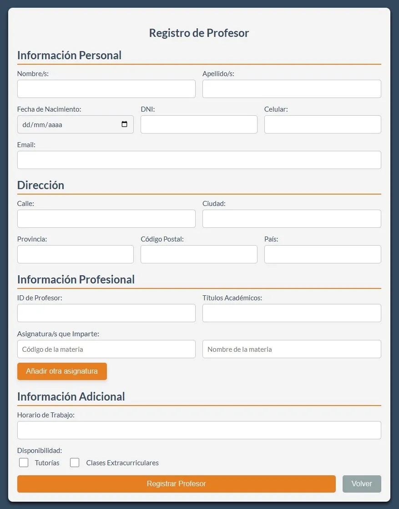 </p>

## Plantilla de Correo Electrónico

La plantilla de correo electrónico diseñada para la funcionalidad de restablecimiento de contraseña está estructurada en `HTML` con `CSS` integrado. En un principio se había elegido este enfoque para asegurar que el estilo del correo se aplique correctamente en la mayoría de los clientes de correo. 

Para lograr la máxima compatibilidad y consistencia visual, el `CSS` se incluyó directamente en el `HTML`, en lugar de usar archivos `CSS` externos. Este método garantiza que el correo se muestre de manera consistente sin importar el cliente de correo que lo reciba.

### Código de Ejemplo
A continuación, se muestra un fragmento del código `HTML` con `CSS` embebido:
```html
 <!-- Content -->
        <div class="content" style="padding: 20px; color: #333333; text-align: center;">
            <h1 style="font-size: 24px; margin-bottom: 20px;">Restablecimiento de Contraseña</h1>
            <p style="margin-bottom: 20px;">Hola,</p>
            <p style="margin-bottom: 20px;">Hemos recibido una solicitud para restablecer la contraseña de tu cuenta en School Manager para la Institución Donorino High School.</p>
            <p style="margin-bottom: 20px;">Para proceder, haz clic en el siguiente botón y sigue las instrucciones:</p>
            <a href="" style="display: inline-block; background-color: #374f59; color: #ffffff; padding: 10px 20px; border-radius: 5px; text-decoration: none;">Restablecer Contraseña</a>
            <p style="margin-top: 20px;">Si no solicitaste este cambio, puedes ignorar este correo. Tu contraseña actual seguirá siendo válida.</p>
            <p style="margin-top: 20px;">Gracias por ser parte de nuestra comunidad educativa.</p>
        </div>
```

<p align="center">
  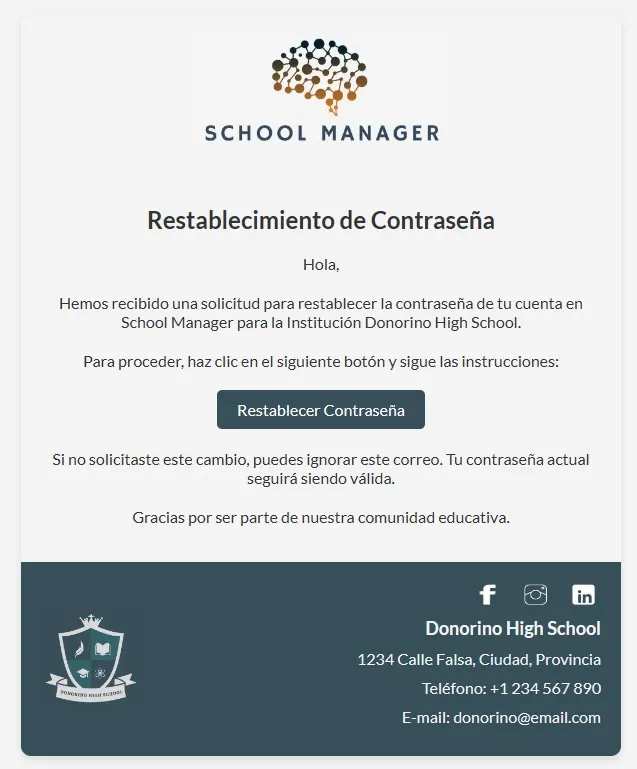
</p>

## Plantilla de Notificaciones

La sección de notificaciones se compone de dos vistas:

### Vista de Notificaciones

Esta vista permite al usuario ver una lista de notificaciones recientes. Cada notificación muestra la fecha, el asunto y la primera línea del mensaje. El usuario puede regresar a la página principal utilizando el botón correspondiente.

<p align="center">
  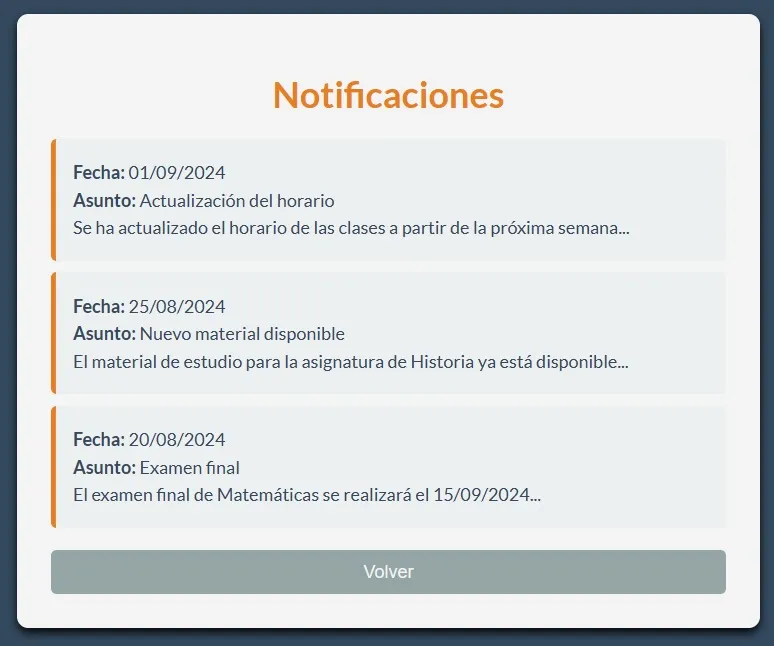
</p>

### Vista de Respuesta a Notificación

En esta vista, el usuario puede responder a una notificación específica. El mensaje original se muestra en la parte superior y el usuario puede escribir y enviar su respuesta mediante un formulario. Después de enviar la respuesta, puede volver a la lista de notificaciones.

<p align="center">
  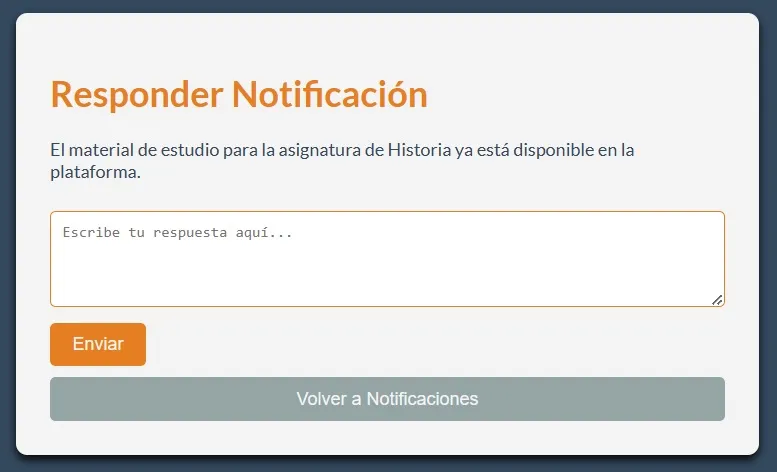
</p>

### Vista de Envío de Notificación
Esta vista permite al profesor enviar notificaciones a estudiantes o padres de forma individual o a todos los usuarios seleccionados de una clase. El formulario está dividido en tres secciones principales:

* Selección de Año y Turno: El usuario puede seleccionar el año y turno para filtrar el grupo de estudiantes o padres a los que se enviará la notificación.

<p align="center"> 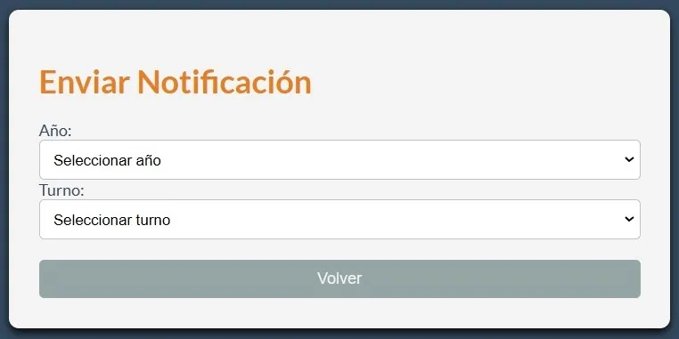 </p>

* Opción de Enviar a Todos o Individualmente: Una vez seleccionado el año y el turno, el usuario puede optar por enviar la notificación a todos los estudiantes/padres o buscar un estudiante o padre específico mediante el DNI.

<p align="center"> 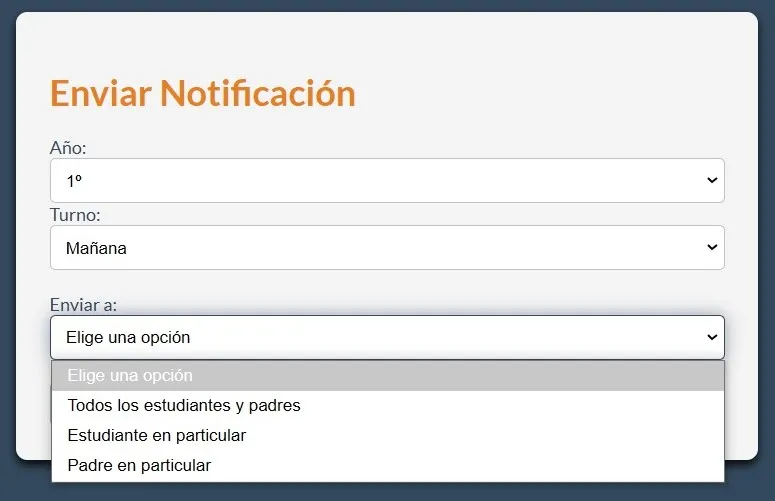 </p>

* Formulario de Notificación: Dependiendo de la opción seleccionada, el usuario puede escribir y enviar un mensaje personalizado a todos los destinatarios o a un destinatario específico. En el caso de búsqueda por DNI, el nombre del estudiante o padre se muestra tras la búsqueda exitosa.

<p align="center">
  <strong>Elección de "Todos los estudiantes y padres"</strong>
</p>
<p align="center"> 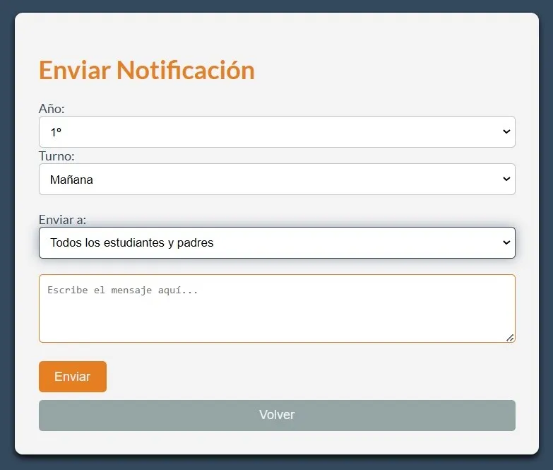 </p>

<p align="center">
  <strong>Elección de "Estudiante en particular"</strong>
</p>

<p align="center"> 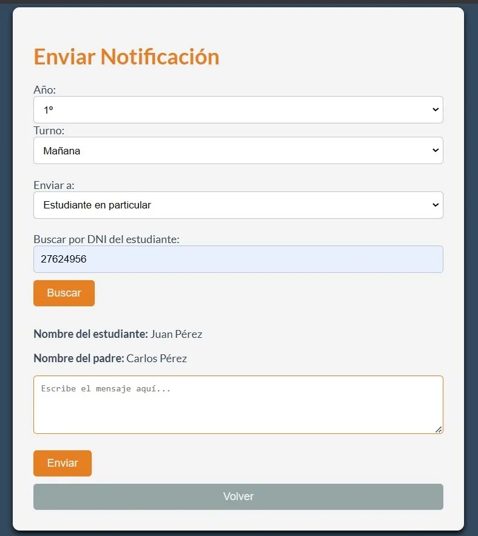 </p>

## Plantilla de Evaluaciones

La sección de evaluaciones se divide en dos vistas:

### Vista del Profesor

El profesor tiene acceso a una vista para cargar evaluaciones. En esta vista, el profesor puede ingresar el DNI del estudiante, seleccionar el año y trimestre, y proporcionar detalles sobre la evaluación. Esta información se envía al sistema y se guarda en la base de datos, asociada al estudiante correspondiente.

<p align="center">
  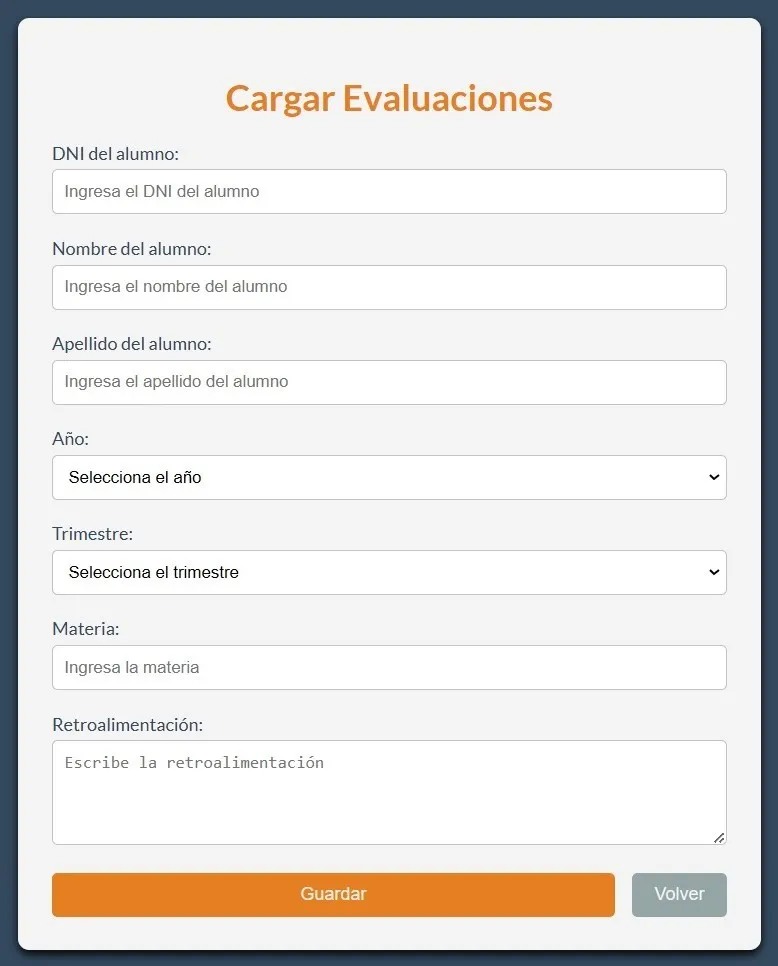
</p>

### Vista del Estudiante

El estudiante puede acceder a una vista donde se muestran las evaluaciones que el profesor ha cargado. Esta vista permite al estudiante consultar sus evaluaciones previas, visualizando la información relevante como el año, trimestre, materia y feedback proporcionado por el profesor.

<p align="center">
  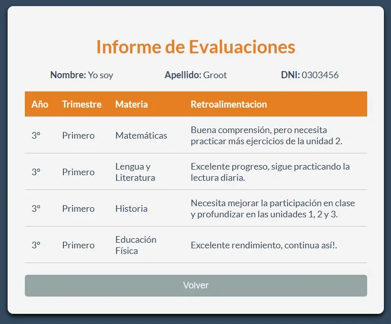
</p>


## Plantilla de Historial Académico

La vista de historial académico permite al estudiante ver su historial de notas cargado por el profesor. Incluye la información básica del estudiante y una tabla detallada con las materias, las notas obtenidas, el estado de la materia y la fecha del acta.

### Vista de Historial Académico del Estudiante

Esta vista muestra:

- Información del estudiante: nombre, apellido y DNI.
- Una tabla con las siguientes columnas: Año, Materia, Nota, Estado Materia y Fecha del Acta. 


<p align="center">
  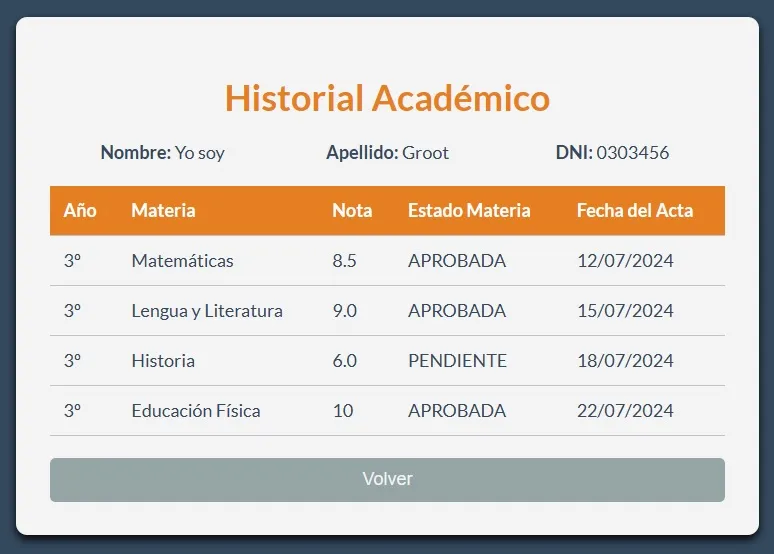
</p>

## Autor

Este diseño fue creado por [Fica](mailto:ficamillan@gmail.com).

Puedes conectar conmigo a través de:

[](https://github.com/Fica-Millan)
[](https://www.linkedin.com/in/yesica-fica-millan/)
